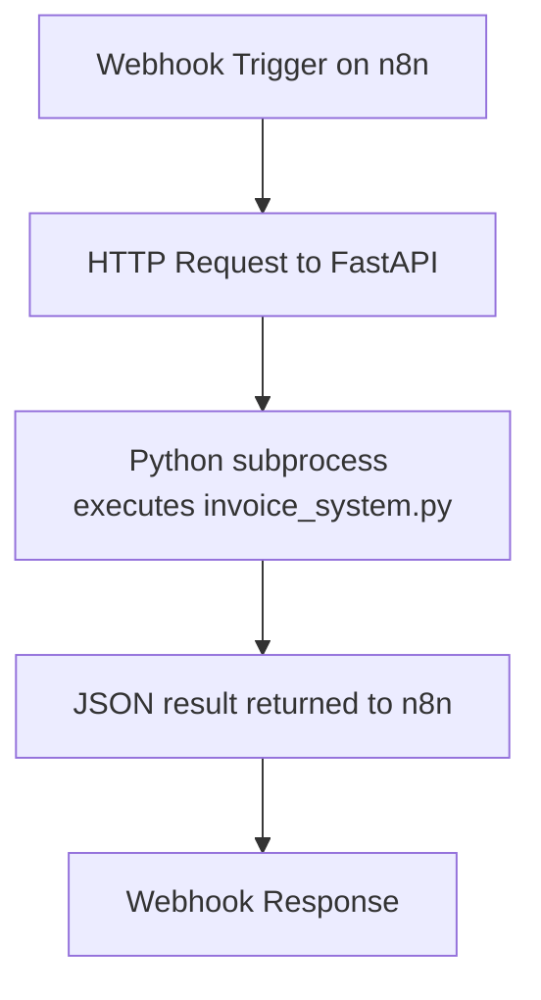

# n8n-order2good-wf
An n8n workflow to automate order to good list comparison workflow

# 🧾 Invoice Processing Automation via n8n + FastAPI

This project sets up a simple workflow automation using [n8n](https://n8n.io/) and a FastAPI backend to extract and normalize invoice data. The FastAPI app uses a Python subprocess to run a custom invoice processing script in an isolated environment with all necessary dependencies.

---

## 📐 Workflow Overview



---

## 🛠️ Environment Setup

### 🐳 Prerequisites
- Docker installed on your system
- n8n and FastAPI app containers run on the same custom Docker network (`n8n-net`)

### 1. Create Docker Network
```bash
docker network create n8n-net
```

---

### 2. Set Up n8n (Linux)
```bash
docker pull n8nio/n8n:latest
docker run -d \
  --name n8n-container \
  --network n8n-net \
  -p 5678:5678 \
  n8nio/n8n:latest
```

#### ✅ Windows Users
Use Docker Desktop to start `n8n-container` with the same image (`n8nio/n8n:latest`).

🖥️ [Watch Setup Tutorial](https://www.youtube.com/watch?v=dC2Q_cyzgjg)

---

### 3. Set Up Python API Container
Ensure you are in the directory where `Dockerfile` is located:
```bash
cd ./docker
docker build -t fastapi-python-app .
```

Run FastAPI app container:
```bash
docker stop python-api && docker rm python-api
docker run -d \
  --name python-api \
  --network n8n-net \
  -p 8000:8000 \
  fastapi-python-app
```

Verify network:
```bash
docker inspect n8n-container | grep Network
docker exec -it n8n-container ping python-api
```

---

## 📄 Dockerfile (for Python container)

```Dockerfile
FROM python:3.10-slim

WORKDIR /app

COPY . /app

RUN apt-get update && \
    apt-get install -y poppler-utils tesseract-ocr libglib2.0-0 libsm6 libxrender1 libxext6 && \
    pip install --no-cache-dir pandas fuzzywuzzy[speedup] pytesseract pdf2image pillow \
    "PyMuPDF" pdfplumber easyocr python-multipart uvicorn fastapi && \
    apt-get clean

CMD ["uvicorn", "app:app", "--host", "0.0.0.0", "--port", "8000"]
```

---

## 🚀 Workflow Usage

Once containers are up and running, you can trigger the workflow using:

```bash
curl -X POST http://localhost:5678/webhook-test/invoice-process \
  -F invoice_file=@"/mnt/d/invoice test/test_image_01.jpeg" \
  -F goods_file=@"/mnt/d/invoice test/customer.goods.csv" \
  -F min_score=80
```

---

## 🔄 Workflow Flow

1. **Webhook Node** receives multipart form data (`invoice_file`, `goods_file`, `min_score`)
2. **HTTP Request Node** sends form data to FastAPI endpoint (`/process-invoice`)
3. **FastAPI** runs `invoice_system.py` as a subprocess
4. **Result** is returned as JSON to n8n and accessible via the webhook response

---

## 🧠 Notes

- The Python container runs `invoice_system.py` using a full suite of OCR and parsing libraries.
- FastAPI uses `python-multipart` to parse form uploads.
- Add `min_score` only if needed (as an integer, not string).

---

## 🧩 Troubleshooting

- If `python-api` is unreachable from `n8n`, ensure both containers share the same Docker network (`n8n-net`)
- Errors like `"Expected UploadFile"` or `"unable to parse string as an integer"` usually point to incorrect form field formats
- Quoting numbers in form uploads can lead to parsing issues in FastAPI

---

## 📬 Contact

For bugs or questions, feel free to reach out or submit an issue.

---

Happy automating! 🎉
